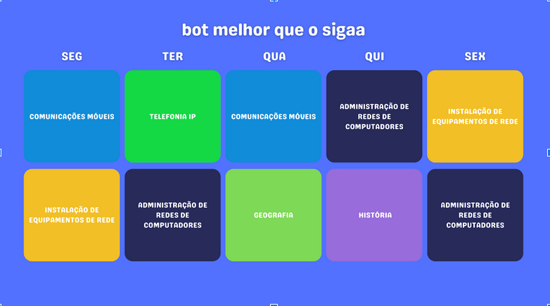

# discord-chatbot

## Premissa da aplicação

	Adicionar a funcionalidade de criar horário para as turmas. A ideia se baseia em permitir que seja configurado por meio de comandos os horários de diferentes turmas, e que com estes horários de forma automática o bot crie uma imagem do calendário semanal para cada turma, e guardar estas imagens em seu banco de dados, e ainda adicionar a função de pedir estas imagens para o bot, assim no início de cada semestre um aluno pode configurar este horário e depois sempre que alguém quiser saber o horário de sua turma, se já estiver configurado seja só executar um comando.

 

